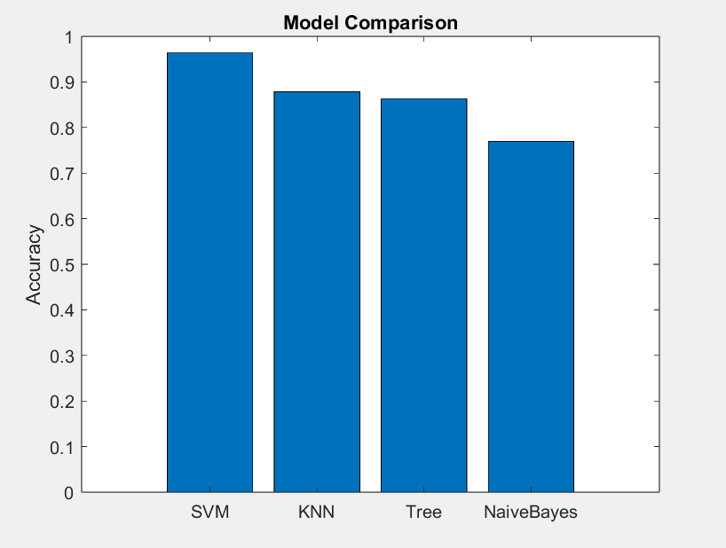

# Human Activity Recognition Using Machine Learning

## Project Description
The aim of this project is to build a machine learning system that can automatically recognize human activities using smartphone sensor data. The dataset consists of signals collected from accelerometer and gyroscope sensors, and the model is trained to classify activities such as walking, sitting, standing, upstairs, downstairs, and laying.

The project is implemented in MATLAB and follows a complete pipeline including data loading, model training, evaluation, and analysis. Additional steps such as model comparison, cross-validation, and feature importance are included to improve performance and understanding of the model.

## Setup Instructions
- Install MATLAB (R2020 or later recommended)
- Ensure Machine Learning Toolbox is available
- Keep all .m files in the same folder
- Download the dataset and update the path inside loadData.m

## Steps to Run the Project
1. Open MATLAB  
2. Navigate to the project folder  
3. Run the following command:

   main

4. The program will:
   - Load the dataset  
   - Train the model  
   - Perform predictions  
   - Evaluate performance  
   - Display results  

   ## File Structure
   
- main.m → Entry point of the project (runs full pipeline)
- loadData.m → Loads training and testing dataset
- trainModel.m → Trains the machine learning model
- evaluateModel.m → Evaluates model performance
- compareModels.m → Compares different ML models
- featurecross.m → Performs feature importance and cross-validation
- precisin.m → Calculates precision, recall, and F1 score

## Results

- Overall Accuracy: ~96%
- Cross-validation Accuracy: ~98%
- High Precision, Recall, and F1-score across all classes
- Confusion matrix shows strong classification performance

### Confusion Matrix

### Feature Importance

### Model Comparison

## Input Data

This project uses the Human Activity Recognition (HAR) dataset based on smartphone sensor data.

Due to the large size of the dataset, it is not included in this repository.

🔗 Dataset Download:
https://archive.ics.uci.edu/static/public/240/human+activity+recognition+using+smartphones.zip

### Instructions:
1. Download the dataset from the above link
2. Extract the ZIP file
3. Place the extracted folder in the project directory (e.g., inside data/)
4. Ensure the folder name is UCI HAR Dataset
5. Update the path in loadData.m if required

The project expects the dataset structure as provided in the original UCI HAR dataset.

## Models Used
- Support Vector Machine (SVM) – main model  
- K-Nearest Neighbors (KNN)  
- Decision Tree  
- Naive Bayes  

Model comparison is performed based on accuracy.

## Machine Learning Models

The models are trained during runtime using the training dataset.

No pre-trained model files are included in this repository.

The main script (main.m) handles:
- Data loading
- Model training
- Evaluation

## Feature Importance
Feature importance analysis is performed to identify the most significant features contributing to activity classification. This helps in understanding the importance of different sensor inputs.

## Cross-Validation
Cross-validation is used to evaluate the reliability of the model. The dataset is divided into multiple folds, and the model is trained and tested on different splits to ensure consistent performance. The average accuracy achieved is around 98%.

## Tools and Dependencies
- MATLAB  
- Machine Learning Toolbox  

## Testing and Verification
- Confusion matrix visualization  
- Accuracy and performance metrics  
- Precision, recall, and F1 score  
- Cross-validation results confirm model stability  

## Notes
- The project is designed for one-click execution using main
- Code is structured and easy to understand
- Inline comments are included for clarity  

## Contact
Amaresh H  
RV College of Engineering, Bangalore
